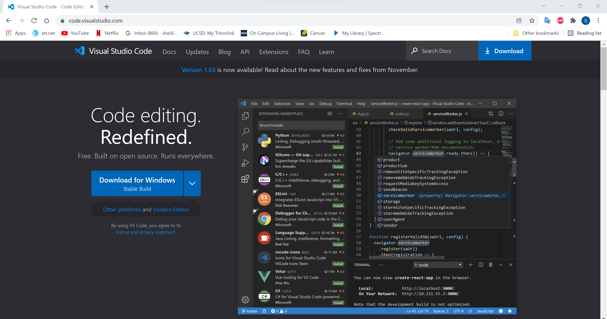
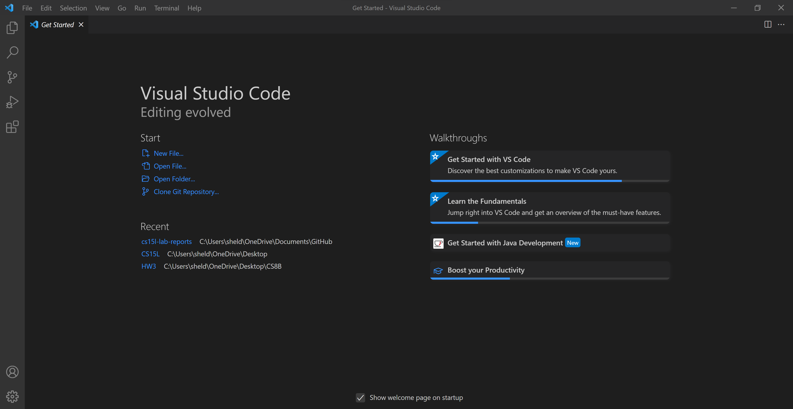
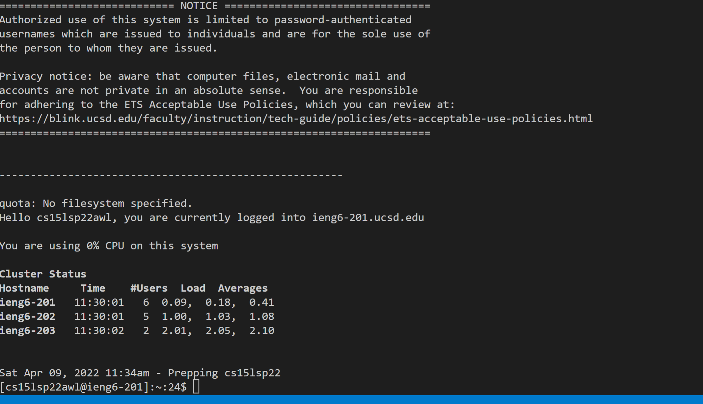
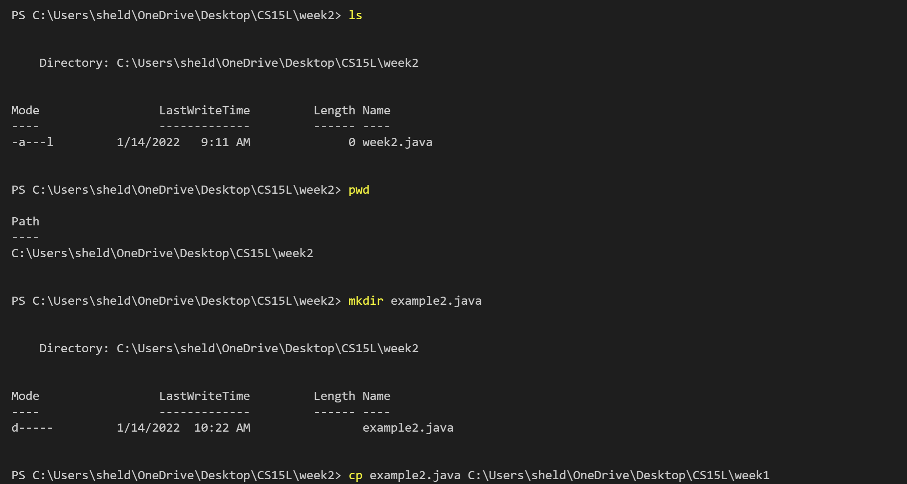
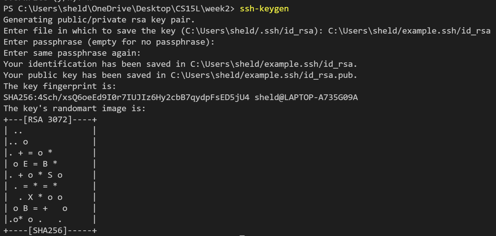

# Lab Report #1: How to log into and use your ieng6 account
## Step 1- VS Code Install

First go to the vs code website [https://code.visualstudio.com](https://code.visualstudio.com/). Download the version from your platform. Open the .exe file and follow the steps for set up. 

After the install it should open to this.

## Step 2- Remotely Connecting

You can connect to your ieng6 from your own device from the terminal line in VS Code, but first you must install the program OpenSSH [here](https://docs.microsoft.com/en-us/windows-server/administration/openssh/openssh_install_firstuse).Then your password must be activated with your school info at [https://sdacs.ucsd.edu/~icc/index.php](https://sdacs.ucsd.edu/~icc/index.php). After install and password activation open a new terminal using the terminal tab at the top in VSCode. Use the `ssh` command along with your course specific username that ends with @ieng6.ucsd.edu.

The terminal will prompt for password and look like below when successful.

## Step 3- Trying Some Commands

There are many commands that can be run from the command terminal.

* `cd`: Changes current diectory to requested one
* `ls`: Lists files in directory
* `pwd`: Shows what directory you are currently in
* `mkdir`: Creates a file of your choice
* `cp`: Copies and pastes a file into a folder of your choosing
* log out with the command `exit`.
>Example:

## Step 4- Moving Files

You are able to move files from your local computer to the remote server using the `scp` command. Use the command followed by the desired file and then followed by your ieng6 account and the directory you want the file in.

The command should look like `> scp week2.java cs15lsp22agb@ieng6.ucsd.edu:~/`
the terminal will then request your password and look like this when succesfullly copied.

## Step 5- SSH key
Using SSH key we can save a key to our local computer and ieng6 server that allows us to enter ieng6 without having to type your password. This brings the time down when logging into ieng6. First use the `ssh-keygen` command at the terminal to generate a private and public key. Give a destination to save the keys, press enter twice for an empty password and it will generate keys.

Then we need to save the private key by logging on to the server and using `mkdir` to create a .ssh folder. Log out and on the client use the command `scp` in this format with your own information to save the key from client to server.

Example:`> scp C:/Users/sheld/.ssh/id_rsa.pub cs15lsp22awl@ieng6.ucsd.edu:~/.ssh/authorized_keys`

 Now you can use the scp and ssh command without the need of a password.

## Step 6- Easy-Peasy Remote Running

There are a couple of ways to optimize working from the client on the server.

1.Use terminal commands with quotes in the same line as ssh to do login run commands and logout with one line.

2.Semi colons can also be used to run multiple commands in the same line. For example:

`>cp example.java Folder;javac example.java; java example.java`

3.Lastly using the up and down arrow you can cycle through your previous terminal commands. Using this greatly speeds up processes like compiling and running.

Using all 3 of these techniques will improve tour work speed.

---

[Home](https://sheldon-f.github.io/cse15l-lab-reports/)