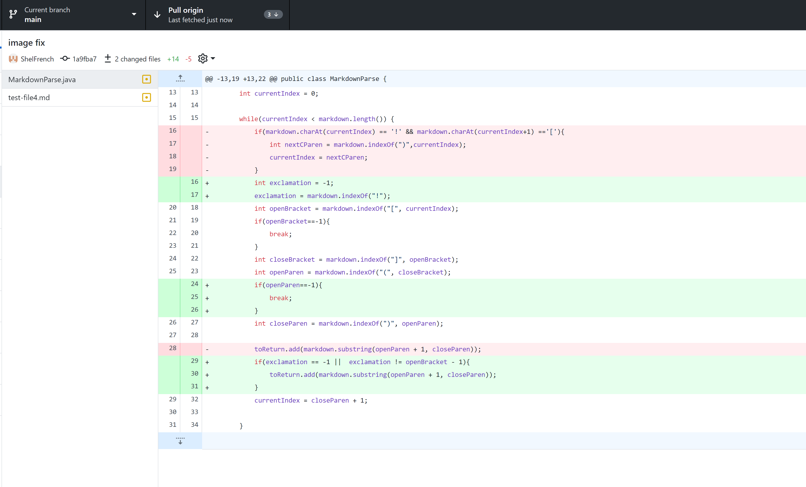
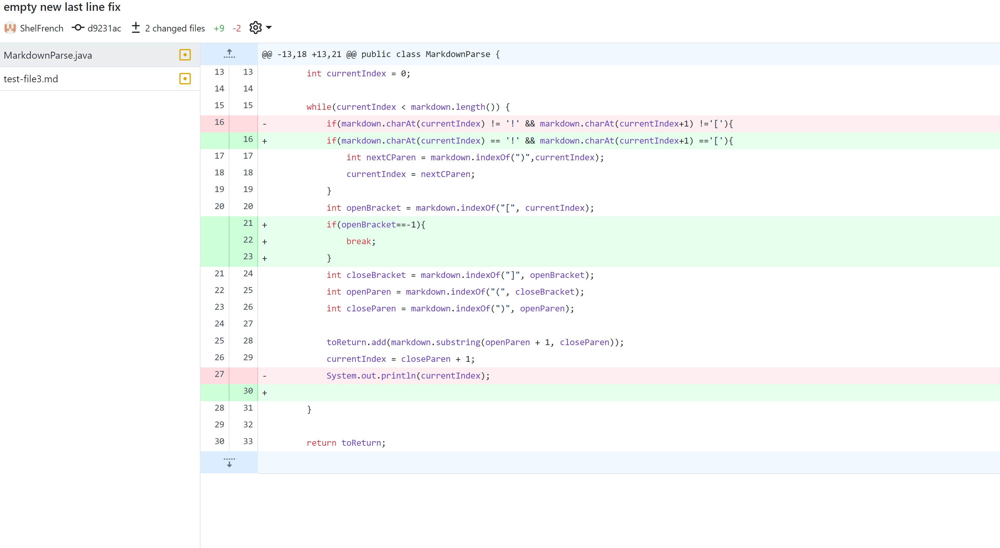
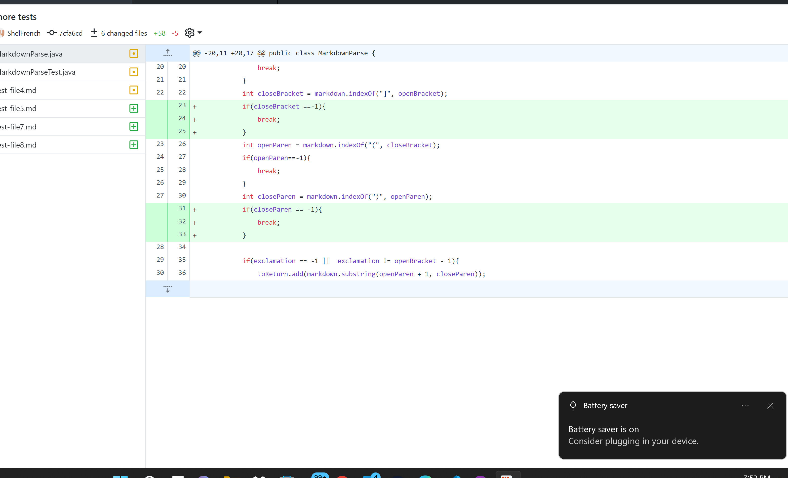

## Lab Report 2

# Image Bug

[test file 2](https://github.com/Sheldon-F/markdown-parser/blob/main/test-file2.md)

symptom: `[.png, https://something.com, some-thing.html]`

what it means: This input file contained an image within it. The brackets and parentheses confused MarkdownParse.java and it included it with links in output. To fix this we inlcude an if statement that skips to next closed bracket when exclamation point was found.
# Empty line

[test file 3](https://github.com/Sheldon-F/markdown-parser/blob/main/test-file3.md?plain=1)

symptom: infinite loop nothing printed

what it means:This input file contained an empty last line. MarkdownParse would keep searching this line after the last link leading to an infinite loop. This was fixed as the method index of returns -1 when nothing is found, and so an if statement is used to break loop when a -1 is returned from indexof closedParen. 
# Brackets

[test file 4](https://github.com/Sheldon-F/markdown-parser/blob/main/test-file4.md)

symptom:`Exception in thread "main" java.lang.StringIndexOutOfBoundsException: begin 0, end -1, length 28
        at java.base/java.lang.String.checkBoundsBeginEnd(String.java:3319)
        at java.base/java.lang.String.substring(String.java:1874)
        at MarkdownParse.getLinks(MarkdownParse.java:28)
        at MarkdownParse.main(MarkdownParse.java:42)`

what it means: This input file contains a "fake link" brackets that are empty with no parentheses. Index of was returning a -1 for openParen as there is no parenthesis. This was fixed with a an if statement that moves next opene bracket after nothing is found

---
[home](index.html)