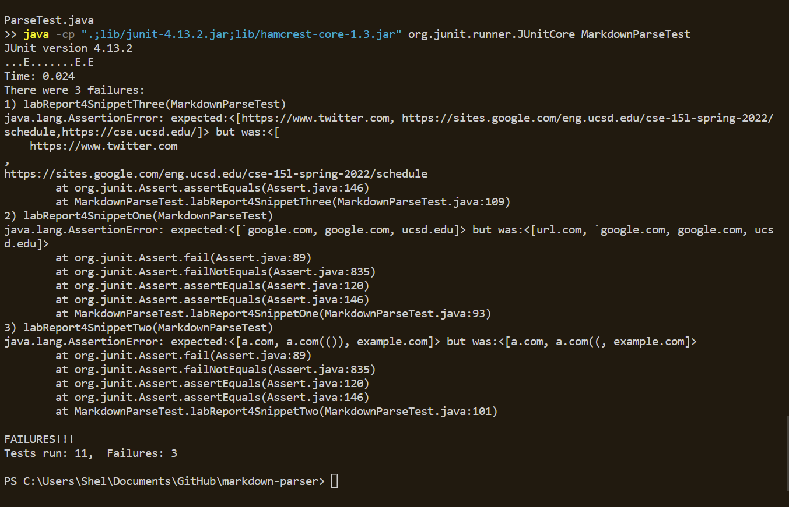

# Lab Report 4

## Reviewed Repository
[Reviewed repository](https://github.com/ddn005UCSD/markdown-parser)

2 of 3 snippet tests failed

## My Repository
[my repo](https://github.com/Sheldon-F/markdown-parser)

### Test code 

### Test Results

- For snippet 1 an if statement can be added top correct behaviour when a backtick is found. This could be done in under 10 lines
- A fix for snippet 2 can be adding an if statment that checks if parentheses are whithin more parentheses. This could be done in under 10 lines
- A fix for snippet 3 can be to check for blank space and remove it. This could be done in less than 10 lines

[home](index.html)
