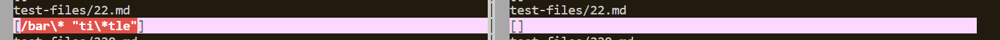
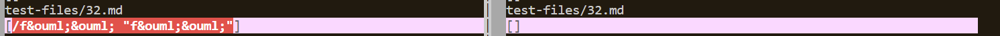

# Lab Report 5

I used the vimdiff command on the two results.txt files made by my markdown parse and the week 9 one.

## Test File 22.md

[22.md link](https://github.com/nidhidhamnani/markdown-parser/blob/main/test-files/22.md)

My markdown parse implementation is incorrect as the link is invalid and should not be detected. The other MD parse succefully skips it.

The left is my incorrect result and right is the correct result.

My markdown parse could be fixed by having a part in my code that checks for invalid characters like quotations. This could check for certain characters and handle it by shifting to  next open bracket.

## Test File 32.md
[32.md link](https://github.com/nidhidhamnani/markdown-parser/blob/main/test-files/32.md)

My markdown parse implementation is incorrect as the link is invalid and should not be detected. The other MD parse succefully skips it.

The left is my incorrect result and right is the correct result.

My markdown parse could be fixed by having code that checks for a `.`. This would help prove an invalid link. If a `.` is not detected then it would be handled by moving to next open bracket.

---
[home](index.md)